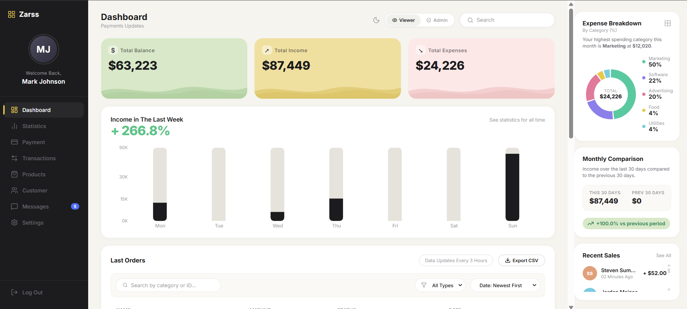
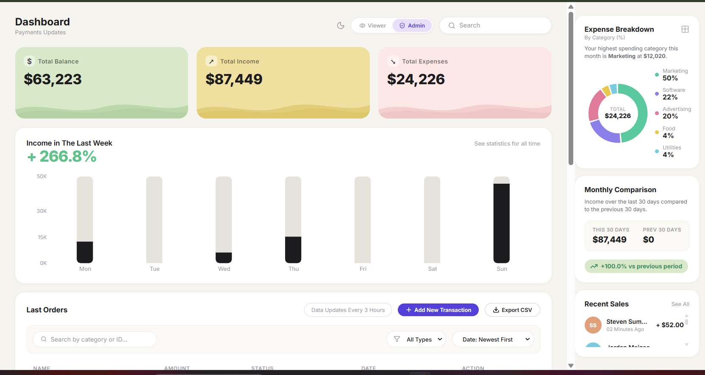
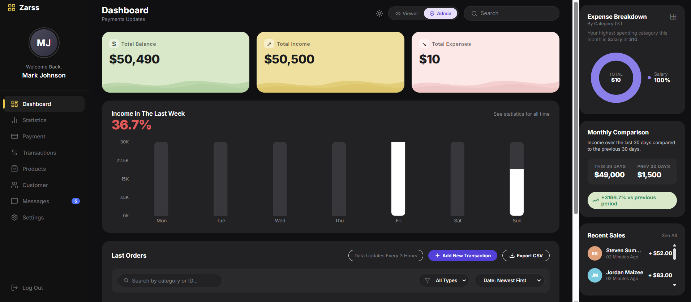

# Zorvyn Dashboard

Zorvyn is a high-fidelity, component-based React dashboard application. Designed with a custom aesthetic and smooth micro-animations, it serves as a lightweight, robust interface for managing and visualizing financial transactions, tracking recent sales, and reporting monthly metrics.





## Key Features

- **Dynamic Theme Management:** Native support for both light and dark modes with a centralized, responsive CSS variable system.
- **Persistent State:** Uses React Context and `useReducer` to manage global application state (transactions, current user role, and theme), cleanly syncing and persisting to browser `localStorage`.
- **Interactive Transactions:** Complex data table that supports sorting, filtering, editing in-place, adding, and deleting mock transaction records.
- **Role-Based UI:** Simulates basic Role-Based Access Control (RBAC). An in-header toggle switches between "Viewer" (read-only) and "Admin" (read-write) modes, enforcing UI restrictions automatically.
- **Data Exporting:** Built-in utility to download the currently filtered view of transactions as a standard CSV format.
- **Responsive Layout Architecture:** Fully fluid design that gracefully breaks down from a complex multi-column desktop layout to an optimized vertical stack on mobile and tablet form factors.
- **Data Visualization:** Integration with Recharts for dynamic, responsive visualizations, including a geometric revenue bar chart and a doughnut metric chart.

## Technology Stack

- **Framework:** React 18
- **Build Tool:** Vite
- **Styling:** Vanilla CSS (component-scoped modular design with global variables)
- **State Management:** React Context API + useReducer
- **Animations:** Framer Motion
- **Icons:** Lucide React
- **Charting:** Recharts

## Setup and Installation

1. Ensure you have Node.js and npm installed on your system.
2. Clone the repository and navigate into the project directory:
   ```bash
   cd zorvyn
   ```
3. Install the required dependencies:
   ```bash
   npm install
   ```
4. Start the local development server:
   ```bash
   npm run dev
   ```
5. Open your browser and navigate to the localhost port provided in your terminal (typically `http://localhost:5173`).

## Project Architecture

The application is structured around feature-centric React components located in the `src/components` directory. Global application logic, including the initial loading from `localStorage` and reducer actions, are securely abstracted into `src/context/DashboardContext.jsx`. The design system is controlled via universal CSS variables defined in `src/App.css`.
